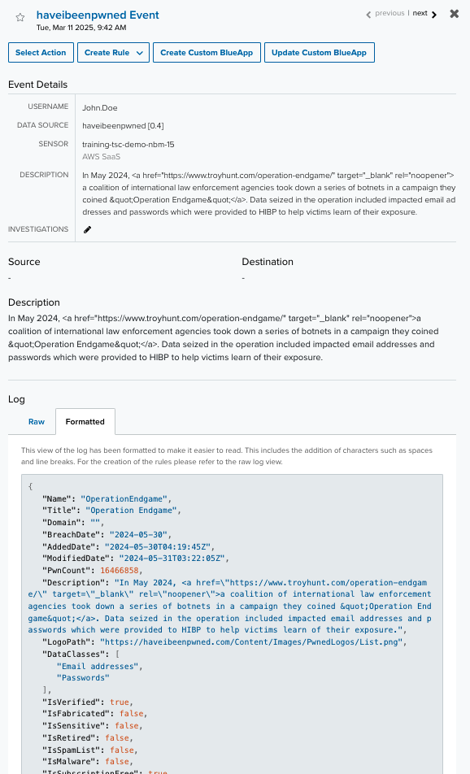

These scripts will query the HIBP API and identify users affected by a breach for a domain. It will then go more information on the breaches affected by each user and send a JSON log for each user to USMA using Webhooks.

**Requirements:**

- USM Anywhere Webhook configured - https://intercom.help/usm-anywhere/en/articles/9786840-webhooks
- VALID HIBP API - https://haveibeenpwned.com/API/Key
- Python3 installed

**How to use scripts.**

Download script from here.

On the command line move to the location of the script and run the script to create a config file

	python3 hibp.py

Once config file has been created then enter in your HIBP API key along with the USMA webhook url and webhook API key so it looks simialr to below. 

```aiignore
{
    "hibp_api_key": "b33c1a111111b1d2bfb0aebab9b1c3fe",
    "webhook_url": "https://webhook-collector.us-east-1.prod.alienvault.cloud/api/1.0/webhook/push",
    "webhook_api_key": "EXXXXX9UTthXXX306OvZHyLXXci9cS"
}
```

Run the script again and this time it should send the logs to USMA

	python3 hibp.py
  
**Result**

You should see output like below and this means the logs have been sent to USMA.

```
successfully sent event {'Name': 'OperationEndgame', 'Title': 'Operation Endgame', 'Domain': '', 'BreachDate': '2024-05-30', 'AddedDate': '2024-05-30T04:19:45Z', 'ModifiedDate': '2024-05-31T03:22:05Z', 'PwnCount': 16466858, 'Description': 'In May 2024, <a href="https://www.troyhunt.com/operation-endgame/" target="_blank" rel="noopener">a coalition of international law enforcement agencies took down a series of botnets in a campaign they coined &quot;Operation Endgame&quot;</a>. Data seized in the operation included impacted email addresses and passwords which were provided to HIBP to help victims learn of their exposure.', 'LogoPath': 'https://haveibeenpwned.com/Content/Images/PwnedLogos/List.png', 'DataClasses': ['Email addresses', 'Passwords'], 'IsVerified': True, 'IsFabricated': False, 'IsSensitive': False, 'IsRetired': False, 'IsSpamList': False, 'IsMalware': False, 'IsSubscriptionFree': True, 'IsStealerLog': False, 'User': 'John.Doe'} to webhook
successfully sent event {'Name': 'Stratfor', 'Title': 'Stratfor', 'Domain': 'stratfor.com', 'BreachDate': '2011-12-24', 'AddedDate': '2013-12-04T00:00:00Z', 'ModifiedDate': '2013-12-04T00:00:00Z', 'PwnCount': 859777, 'Description': 'In December 2011, &quot;Anonymous&quot; <a href="http://www.troyhunt.com/2011/12/5-website-security-lessons-courtesy-of.html" target="_blank" rel="noopener">attacked the global intelligence company known as &quot;Stratfor&quot;</a> and consequently disclosed a veritable treasure trove of data including hundreds of gigabytes of email and tens of thousands of credit card details which were promptly used by the attackers to make charitable donations (among other uses). The breach also included 860,000 user accounts complete with email address, time zone, some internal system data and MD5 hashed passwords with no salt.', 'LogoPath': 'https://haveibeenpwned.com/Content/Images/PwnedLogos/Stratfor.png', 'DataClasses': ['Credit cards', 'Email addresses', 'Names', 'Passwords', 'Phone numbers', 'Physical addresses', 'Usernames'], 'IsVerified': True, 'IsFabricated': False, 'IsSensitive': False, 'IsRetired': False, 'IsSpamList': False, 'IsMalware': False, 'IsSubscriptionFree': False, 'IsStealerLog': False, 'User': 'Mike.Appleseed'} to webhook
```

**NOTE**

A plugin/Parser/App will need to be created on the USMA side to parse the data out this can be created by following the instuctions in this [link](https://cybersecurity.att.com/documentation/usm-anywhere/alienapps-guide/custom-app-builder/configuring-custom-alienapp.htm)

Sample parsing 

```{
   "name": "haveibeenpwned",
   "device": "haveibeenpwned",
   "type": "JSON",
   "appFormat": "JSON",
   "version": "0.1",
   "highlight_fields": "source_user_email,domain_name,event_description,last_updated,source_username,legacy_date",
   "hints": [],
   "tags": {
      "event_name": {
         "matches": [
            "'haveibeenpwned Event'"
         ]
      },
      "last_updated": {
         "matches": [
            "map('$.ModifiedDate')"
         ]
      },
      "searched_site": {
         "matches": [
            "map('$.Title')"
         ]
      },
      "legacy_date": {
         "matches": [
            "map('$.BreachDate')"
         ]
      },
      "domain_name": {
         "matches": [
            "map('$.Domain')"
         ]
      },
      "event_description": {
         "matches": [
            "map('$.Description')"
         ]
      },
      "source_user_email": {
         "matches": [
            "map('$.Email')"
         ]
      },
      "source_username": {
         "matches": [
            "map('$.User')"
         ]
      }
   }
}
```

***NOTE***


Log after parsing



